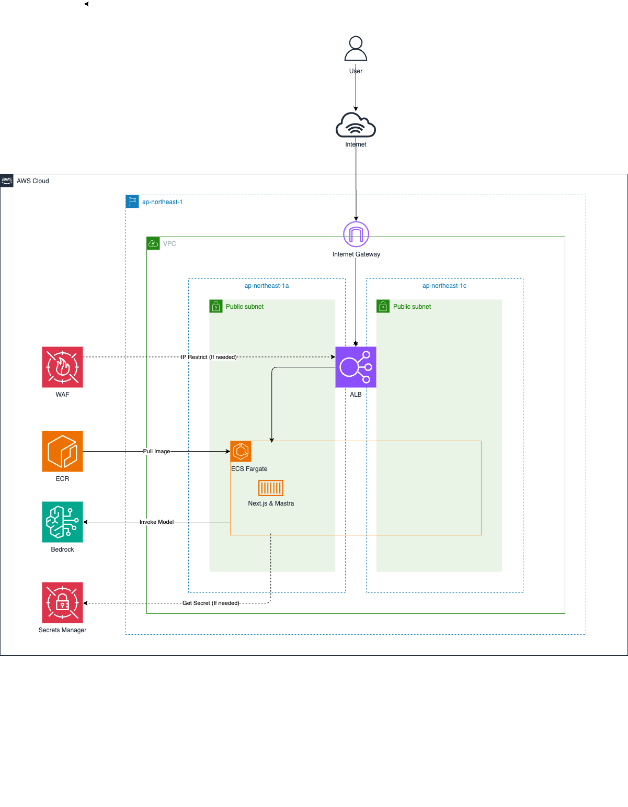

# Next.js Mastra MCP with AWS

AWS CDK project for running Mastra Agent and Next.js application with Amazon ECS and Amazon Bedrock to interact with MCP Server.  
As an example, this project uses [Playwright MCP server](https://github.com/microsoft/playwright-mcp).

## Prerequisites

- Node.js: v20 or higher
- AWS CDK: v2 or higher
- Docker: v20 or higher
- AWS Credentials: Access Key / Secret Key / Session Token

# Architecture



## Project Structure

```
.
├── app/                    # Application root directory
│   ├── components/        # React components
│   ├── pages/            # Next.js pages
│   ├── styles/           # CSS styles
│   ├── src/              # Application source code
│   │   └── mastra/       # Mastra application root directory
│   │       ├── index.ts  # Mastra instance configuration
│   │       ├── agents/   # Agent definitions
│   │       └── mcp/      # MCP configuration
│   ├── .env.development  # Environment variables for development
│   ├── Dockerfile        # Container image definition
│   ├── package.json      # Application dependencies
│   └── tsconfig.json     # TypeScript configuration for app
├── infra/                # Infrastructure as Code directory
│   ├── bin/             # CDK application entry point
│   ├── lib/             # CDK stack definitions
│   ├── test/            # Infrastructure test files
│   ├── cdk.json         # CDK configuration
│   ├── package.json     # Infrastructure dependencies
│   └── tsconfig.json    # TypeScript configuration for infra
├── image/               # Architecture diagrams and images
├── package.json        # Root project dependencies
└── tsconfig.json       # Root TypeScript configuration
```

## Getting Started

### Install Dependencies

All commands should be executed at the repository root.

First, install dependencies for the root project.

```bash
npm install:all
```

Next, set up environment variables by creating .env.development file which contains the aws credentials.

```bash
cat << EOF > web/.env.development
ACCESS_KEY_ID=XXXXXXXXXXXXXXXXXXXX
SECRET_ACCESS_KEY=XXXXXXXXXXXXXXXXXXXX
SESSION_TOKEN=XXXXXXXXXXXXXXXXXXXX
EOF
```

### Local Development

If you want to change the application configuration, you can modify the `app/parameter.ts`.

To start local mastra http server only, run the following command.

```bash
npm run mastra:dev
```

To start local Next.js server with mastra, run the following command.

```bash
npm run next:dev
```

### Production Deployment

If you want to change the infrastructure configuration, you can modify the `infra/parameter.ts`.

If you've never used CDK before, you need to [Bootstrap](https://docs.aws.amazon.com/ja_jp/cdk/v2/guide/bootstrapping.html) for the first time only. The following command is unnecessary if your environment is already bootstrapped.

```bash
npx -w infra cdk bootstrap
```

To deploy the application to AWS, run the following command.

```bash
npm run cdk:deploy
```

To remove the application from AWS, run the following command.

```bash
npm run cdk:destroy
```
